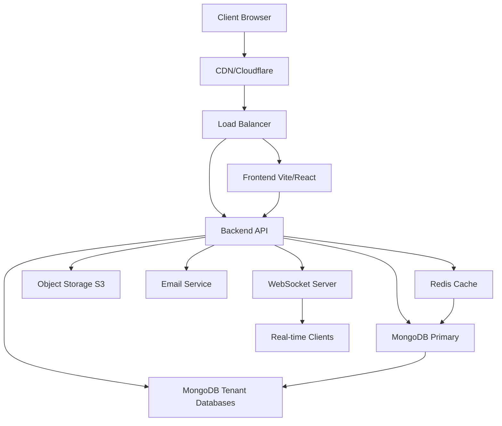

# Alumni Network Platform - Project Assessment & Recommendations

## Executive Summary

The project is a **multi-tenant alumni SaaS platform** with a modern tech stack:

- **Frontend**: React 19 + Vite + Tailwind CSS + React Router + TanStack Query
- **Backend**: Node.js/Express + MongoDB + Mongoose + Socket.IO
- **Architecture**: Multi-tenant with shared/dedicated database support

The platform appears to be in **mid-development stage** with comprehensive feature coverage but requires refinement, testing, and deployment readiness.

## Current State Analysis

### ✅ **Strengths**

1. **Comprehensive Feature Set**
   - Alumni directory with profiles
   - Mentorship system with real-time chat
   - Event management
   - Job board with applications
   - Business directory
   - Community groups
   - Newsroom/announcements
   - Gallery/media management
   - Notifications system

2. **Modern Tech Stack**
   - React 19 with lazy loading
   - Tailwind CSS for styling
   - TanStack Query for data fetching
   - Socket.IO for real-time features
   - Multi-tenant architecture

3. **Good Code Organization**
   - Clear separation of concerns (controllers, models, routes, middleware)
   - Modular component structure
   - Environment configuration examples
   - Error handling middleware

4. **Security Considerations**
   - JWT authentication
   - CSRF protection
   - Rate limiting
   - Role-based access control
   - Input validation middleware

### ⚠️ **Areas Needing Attention**

1. **Missing Documentation**
   - No comprehensive README for the overall project
   - Limited API documentation
   - No deployment guides
   - Missing architecture diagrams

2. **Testing Gaps**
   - Only minimal frontend tests found (`formatters.test.js`)
   - No backend unit/integration tests
   - No end-to-end testing

3. **Configuration & Deployment**
   - No Docker configuration
   - No CI/CD pipeline
   - Production environment setup unclear
   - Missing database migration scripts

4. **Code Quality & Maintenance**
   - No linting configuration (ESLint, Prettier)
   - No TypeScript usage (pure JavaScript)
   - Some scratch files in backend/scratch/ that should be cleaned up

5. **Feature Completeness**
   - Some routes may need implementation verification
   - Frontend-backend integration needs validation
   - Real-time features (Socket.IO) require testing

## Technical Assessment

### Backend Architecture

- **Multi-tenant design**: Supports both shared and dedicated database modes
- **Database layer**: MongoDB with Mongoose, tenant-aware connection manager
- **API structure**: RESTful with WebSocket support for real-time features
- **Authentication**: JWT with refresh tokens, OAuth (Google, LinkedIn) configured
- **File uploads**: Multer for handling file uploads

### Frontend Architecture

- **Routing**: React Router with protected routes
- **State management**: React Context + TanStack Query
- **Styling**: Tailwind CSS with component-specific CSS files
- **Real-time**: Socket.IO client integration
- **Rich text editor**: Tiptap for content creation

### Database Models

The project has comprehensive models covering:

- User management (alumni, institute admins, super admins)
- Content (posts, announcements, events, jobs)
- Relationships (mentorship, community groups)
- Media (gallery items, attachments)
- System (audit logs, notifications)

## Critical Recommendations

### Phase 1: Immediate Improvements (1-2 weeks)

1. **Project Setup & Documentation**
   - Create comprehensive root README.md
   - Add setup instructions for local development
   - Document environment variables
   - Create API documentation

2. **Code Quality & Tooling**
   - Add ESLint + Prettier configuration
   - Consider TypeScript migration plan
   - Clean up scratch files and unused code
   - Add husky pre-commit hooks

3. **Testing Foundation**
   - Set up Vitest for frontend testing
   - Add Jest for backend testing
   - Create basic unit tests for critical utilities
   - Add integration tests for auth flow

### Phase 2: Development Completion (2-4 weeks)

1. **Feature Validation**
   - Test all major user flows end-to-end
   - Verify real-time chat functionality
   - Test file uploads and media handling
   - Validate multi-tenant isolation

2. **Performance Optimization**
   - Implement pagination for large datasets
   - Add caching layer (Redis consideration)
   - Optimize database queries with indexes
   - Implement image optimization

3. **Security Hardening**
   - Security audit of authentication flow
   - Implement proper input sanitization
   - Add helmet.js for security headers
   - Regular dependency updates

### Phase 3: Deployment & DevOps (2-3 weeks)

1. **Containerization**
   - Create Dockerfiles for frontend and backend
   - Docker Compose for local development
   - Production Docker configuration

2. **CI/CD Pipeline**
   - GitHub Actions workflow
   - Automated testing on PRs
   - Build and deployment automation

3. **Monitoring & Observability**
   - Add logging (Winston/Pino)
   - Implement health check endpoints
   - Error tracking (Sentry consideration)
   - Performance monitoring

## Architecture Improvements

### Suggested Enhancements

### Database Considerations

1. **Evaluate MongoDB Atlas** for production
2. **Implement connection pooling** optimization
3. **Add database backup strategy**
4. **Consider read replicas** for scaling

## Feature Roadmap Suggestions

### Short-term (Next 3 months)

1. **Mobile responsiveness** refinement
2. **Advanced search** with filters
3. **Email notifications** system completion
4. **Analytics dashboard** for institute admins
5. **Bulk import/export** for alumni data

### Medium-term (3-6 months)

1. **Mobile app** (React Native consideration)
2. **Payment integration** for premium features
3. **Advanced reporting** and insights
4. **API versioning** strategy
5. **Webhook system** for integrations

### Long-term (6-12 months)

1. **Microservices decomposition** (if scaling needed)
2. **Machine learning** for recommendations
3. **Internationalization** (i18n)
4. **White-labeling** capabilities
5. **Marketplace** for third-party integrations

## Risk Assessment

### High Priority Risks

1. **Security vulnerabilities** in authentication/authorization
2. **Data leakage** between tenants in shared database mode
3. **Performance issues** with large alumni datasets
4. **Lack of backup** and disaster recovery

### Mitigation Strategies

1. **Regular security audits** and penetration testing
2. **Comprehensive testing** of tenant isolation
3. **Load testing** with realistic data volumes
4. **Implement automated backups** and recovery procedures

## Success Metrics

### Technical Metrics

- API response time < 200ms (p95)
- Application uptime > 99.5%
- Test coverage > 80%
- Zero critical security vulnerabilities

### Business Metrics

- User onboarding completion rate
- Active daily users per tenant
- Feature adoption rates
- Customer satisfaction (CSAT)

## Next Immediate Actions

1. **Create detailed project documentation**
2. **Set up local development environment** with one-command setup
3. **Implement basic test suite** for critical paths
4. **Conduct security review** of authentication flow
5. **Plan deployment strategy** for staging environment

## Conclusion

The alumni network platform has a solid foundation with comprehensive features and modern technology choices. The primary focus should shift from feature development to **polishing, testing, and deployment readiness**. With 4-8 weeks of focused effort, this project could be production-ready for initial pilot customers.

The multi-tenant architecture provides a strong foundation for scalability, but requires careful attention to security and performance as tenant count grows.
